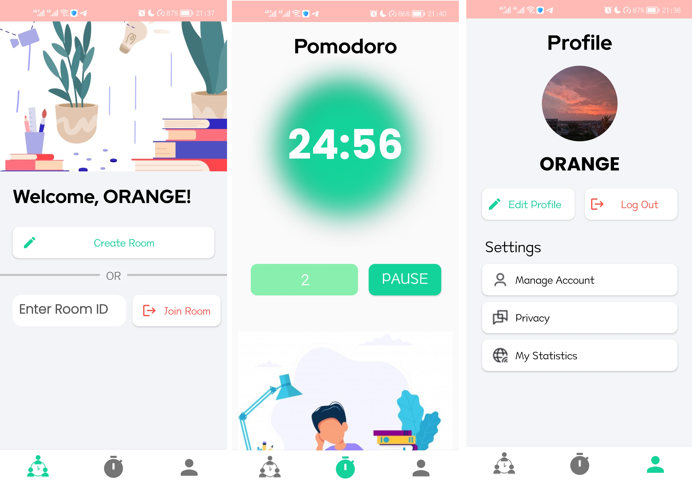
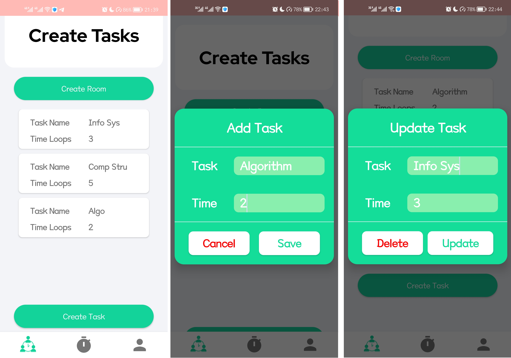
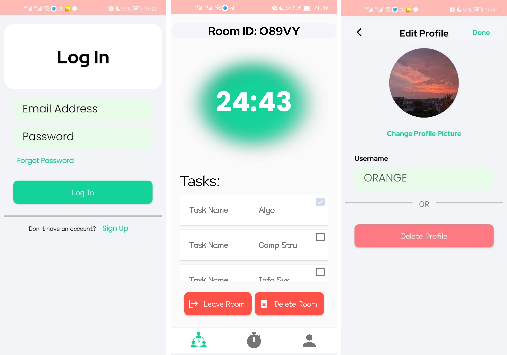

## Description
Studify is designed to make group studying more efficient and convenient for all by providing a virtual, collaborative platform that allows individuals to be more productive with friends, or even alone. 

Take charge and create your own private room as an admin. Invite more peers to join your room and study together and customise group tasks to encourage everyone to strive towards a common goal. Need more motivation and focus? Set Pomodoro timers to motivate everyone to complete them on time. Once you are done with a task, delete them with ease or add more time to the room and extend your studying period with friends.

## App Screenshots 
  
  
  

## Resources
<a href="https://www.figma.com/file/VLmQeGFdPmF4EEZmRTI5M2/App-Layout">
Figma App Designs <a>
 
<a href=https://docs.google.com/document/d/14fCwcmqJ00WbVjJvHaYVmXaJhs1Pl9lmSTjH77cuVwY/edit#heading=h.7v9j2i4f9rgq>
Final Report</a>

## External Dependencies  
<a href="https://github.com/bumptech/glide">
Glide </a> - used to display and fetch user profile picture
 
<a href="https://github.com/hdodenhof/CircleImageView">
CircleImageView </a> - fast circular ImageView used for user profile images
 

## Commit  
**2 Activities:** MainActivity, AuthActivity  
**11 Fragments:** EditProfileFragment, ForgetPasswordFragment, LoginFragment, MainFragment,  PomodoroFragment, ProfileFragment, RegisterFragment, RoomAdminFragment, RoomFragment, RoomList Fragment, TaskListFragment  
**Package Name:** com.example.studify  

<!-- ### data
> *UserDatabase*  
> * empty -->

### models
> *authentication*
> > *AuthAppRepository*  
> > * methods: register, addUser, login, logOut, resetPassword, deleteProfile 
> >
> *room* 
> > *AddTaskModel* 
> > * data class to help add tasks for a specific room
> >
> > *RandomString* 
> > * class to help generate random strings for Room ID allocation
> >
> > *RoomModel* 
> > * data class to help build rooms
> > *GroupTimeRepository*  
> >* room methods: timer
> >
> > *RoomAppRepository*  
> > * methods: createroom
> >
> > *TimerRepository*  
> > * methods: startStop,startTimer,stopTimer,updateTimer, getTimerLeftLiveData,getIsFinished
> >
> > *GroupTimerRepository* 
> > * methods: join,startTimer,startBreakTimer,updaterTimer,updateBreakTimer,getCount,getTimerLeftLiveData
> >
> *user*
> > *UserProfileModel*  
> > * data class to build new users models
> >
> > *UserAppRepository*  
> > * methods: updateProfile & getUserDetails

### navigation
> *auth* 
> * navigates between LoginFragment,  ForgetPasswordFragment & RegisterFragment
>
> *main* 
> * navigates between EditProfileFragment, MainFragment, PomodoroFragment,  ProfileFragment, RoomAdminFragment, RoomFragment,  RoomList Fragment &TaskListFragment

### viewmodels
> *LoginViewModel*  
> * authentication methods: login,  register, resetPassword
>
> *MainActivityViewModel*  
> * room methods: timer
>
> *RoomViewModel*  
> * room methods: createRoom, startGroupTimer, getGroupTimerLeftLiveDate
>
> *UserViewModel*  
> * authentication methods: logOut, deleteProfile, getLoggedOutLiveData
> * user methods: updateProfile, getUserProfileLiveData

### ui
> *adapter*
> > Adapter
> > * recyclerview adapter for displaying tasks in the room fragment
>
> *authentication*
> > *login* 
> > LoginFragment
>
> > *register* 
> > RegisterFragment
>
> > *forgot password* 
> > ForgotPasswordFragment 
>
> AuthActivity
> 
> *main*
> > *room* 
> > > *pomodoro timer* 
> > > PomodoroFragment
> > > 
> >
> > > *room admin* 
> > > RoomAdminFragment
> > >
> >
> > > *room* 
> > > RoomFragment
> > > 
> >
> > > *room list* 
> > > RoomListFragment (firebase)
> > >
> >
> > > *task list* 
> > > TaskListFragment
> > > * user methods: addTask, updateTask
> >

> >
> > *user*
> > > *user profile*  
> > > ProfileFragment
> > > * user methods: updateProfile, logOut
> > 
> > > *edit profile*  
> > > EditProfileFragment 
> > > * user methods: updateProfilePicture, updateUserName, deleteProfile
> >
> > MainFragment  
> > MainActivity 
> >
